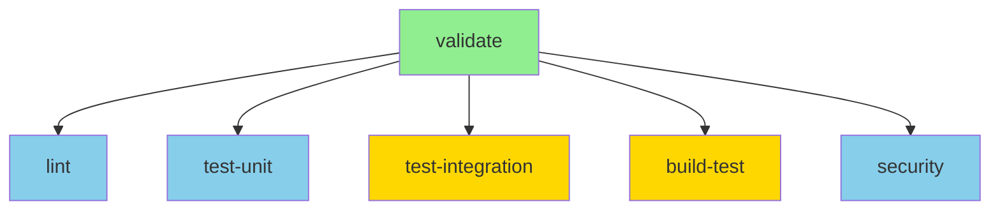
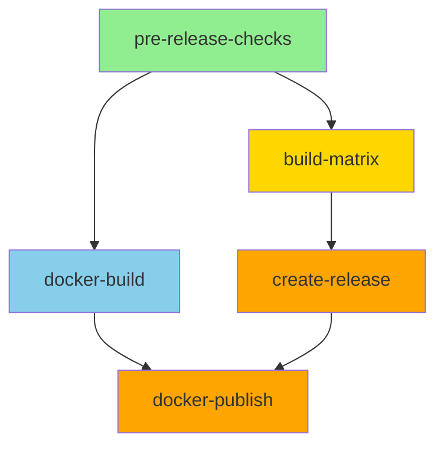

# GitHub Actions Improvements - Technical Specification

## Status
**Lifecycle Stage**: Draft  
**Created**: 2025-01-03  
**Technical Lead**: TBD

## Executive Summary

This specification details the technical implementation required to fix critical CI/CD failures in the Glide project. The current setup has a 100% failure rate due to Go version mismatches, test failures, and configuration issues. This document outlines a phased migration from the current 3-workflow system to an optimized 2-workflow architecture.

## Current State Analysis

### Existing Architecture
```
.github/workflows/
├── ci.yml          # Comprehensive CI (failing - Go 1.21 vs 1.24 mismatch)
├── test-build.yml  # Build testing (redundant, failing)
└── release.yml     # Release automation (blocked by CI failures)
```

### Critical Issues

| Issue | Severity | Impact | Root Cause |
|-------|----------|--------|------------|
| Go Version Mismatch | P0 | Blocks all builds | go.mod requires 1.24, workflows use 1.21 |
| Docker Build Failure | P0 | No container images | Dockerfile uses Go 1.21 |
| Test Case Sensitivity | P0 | Integration tests fail | Expects "bind", gets "Bind" |
| Lint Issues | P1 | CI fails | 33 unused functions |
| Workflow Duplication | P1 | Resource waste | 3 overlapping workflows |
| No Caching | P2 | Slow builds | Missing cache configuration |

## Proposed Architecture

### Target Workflow Structure
```
.github/workflows/
├── ci.yml       # Development validation (PR/push)
└── release.yml  # Production releases (tags/manual)
```

### Workflow Responsibility Matrix

| Workflow | Triggers | Purpose | Jobs |
|----------|----------|---------|------|
| **ci.yml** | push (main/develop), PR | Fast validation & feedback | validate, lint, test-unit, test-integration, build-test, security |
| **release.yml** | tags (v*), manual | Production artifacts | pre-checks, build-matrix, docker, release, publish |

### Job Dependency Graph

#### CI Workflow


#### Release Workflow


## Implementation Plan

### Phase 1: Critical Fixes (Immediate)

#### 1.1 Go Version Alignment
```yaml
# Update in all workflows
env:
  GO_VERSION: '1.24'  # Changed from '1.21'
```

```dockerfile
# Dockerfile update
FROM golang:1.24-alpine AS builder  # Changed from 1.21
```

#### 1.2 Fix Test Case Sensitivity
```go
// tests/integration/docker_test.go
// Change from:
assert.Contains(t, err.Error(), "bind")
// To:
assert.Contains(t, strings.ToLower(err.Error()), "bind")
```

#### 1.3 Address Critical Lint Issues
```bash
# Remove unused functions or add //nolint:unused directives
# Priority: Functions causing build failures
```

### Phase 2: Workflow Consolidation

#### 2.1 Enhanced CI Workflow
```yaml
name: CI
on:
  push:
    branches: [main, develop]
  pull_request:
    branches: [main]
  workflow_call:  # Allow reuse from release workflow

env:
  GO_VERSION: '1.24'
  CACHE_VERSION: v1

jobs:
  validate:
    name: Validate
    runs-on: ubuntu-latest
    outputs:
      cache-key: ${{ steps.cache.outputs.key }}
    steps:
      - uses: actions/checkout@v4
      - uses: actions/setup-go@v5
        with:
          go-version: ${{ env.GO_VERSION }}
          cache: true
      - run: go mod download
      - run: go mod verify
      - id: cache
        run: echo "key=${{ runner.os }}-go-${{ env.GO_VERSION }}-${{ hashFiles('**/go.sum') }}" >> $GITHUB_OUTPUT

  lint:
    needs: validate
    runs-on: ubuntu-latest
    steps:
      - uses: actions/checkout@v4
      - uses: actions/setup-go@v5
        with:
          go-version: ${{ env.GO_VERSION }}
          cache: true
      - uses: golangci/golangci-lint-action@v3
        with:
          version: latest
          args: --timeout=5m

  test-unit:
    needs: validate
    runs-on: ubuntu-latest
    steps:
      - uses: actions/checkout@v4
      - uses: actions/setup-go@v5
        with:
          go-version: ${{ env.GO_VERSION }}
          cache: true
      - run: go test -race -coverprofile=coverage.out -covermode=atomic ./...
      - uses: codecov/codecov-action@v3
        with:
          file: ./coverage.out

  test-integration:
    needs: validate
    runs-on: ubuntu-latest
    steps:
      - uses: actions/checkout@v4
      - uses: actions/setup-go@v5
        with:
          go-version: ${{ env.GO_VERSION }}
          cache: true
      - run: go test -tags=integration -timeout=5m ./tests/integration/...

  build-test:
    needs: validate
    strategy:
      fail-fast: true
      matrix:
        include:
          - {goos: linux, goarch: amd64}
          - {goos: darwin, goarch: amd64}
          - {goos: windows, goarch: amd64}
    runs-on: ubuntu-latest
    steps:
      - uses: actions/checkout@v4
      - uses: actions/setup-go@v5
        with:
          go-version: ${{ env.GO_VERSION }}
          cache: true
      - run: |
          CGO_ENABLED=0 GOOS=${{ matrix.goos }} GOARCH=${{ matrix.goarch }} \
          go build -o test-binary ./cmd/glid

  security:
    needs: validate
    runs-on: ubuntu-latest
    continue-on-error: true  # Don't block on security issues initially
    steps:
      - uses: actions/checkout@v4
      - uses: actions/setup-go@v5
        with:
          go-version: ${{ env.GO_VERSION }}
      - uses: securego/gosec@master
        with:
          args: '-fmt sarif -out results.sarif ./...'
      - uses: github/codeql-action/upload-sarif@v2
        if: always()
        with:
          sarif_file: results.sarif
```

#### 2.2 Optimized Release Workflow
```yaml
name: Release
on:
  push:
    tags: ['v*.*.*']
  workflow_dispatch:
    inputs:
      version:
        description: 'Version tag'
        required: true

jobs:
  test:
    uses: ./.github/workflows/ci.yml  # Reuse CI validation
    
  build:
    needs: test
    strategy:
      matrix:
        include:
          - {os: linux, arch: amd64, goos: linux, goarch: amd64}
          - {os: linux, arch: arm64, goos: linux, goarch: arm64}
          - {os: darwin, arch: amd64, goos: darwin, goarch: amd64}
          - {os: darwin, arch: arm64, goos: darwin, goarch: arm64}
          - {os: windows, arch: amd64, goos: windows, goarch: amd64, ext: .exe}
    runs-on: ubuntu-latest
    steps:
      - uses: actions/checkout@v4
      - uses: actions/setup-go@v5
        with:
          go-version: '1.24'
          cache: true
      - run: |
          VERSION=${{ github.ref_name }}
          CGO_ENABLED=0 GOOS=${{ matrix.goos }} GOARCH=${{ matrix.goarch }} \
          go build -ldflags="-s -w -X main.version=${VERSION}" \
          -o glid-${{ matrix.os }}-${{ matrix.arch }}${{ matrix.ext }} ./cmd/glid
      - uses: actions/upload-artifact@v3
        with:
          name: binaries
          path: glid-*
```

### Phase 3: Performance Optimization

#### 3.1 Caching Strategy
```yaml
# Comprehensive caching configuration
- uses: actions/cache@v3
  with:
    path: |
      ~/.cache/go-build
      ~/go/pkg/mod
      ~/.cache/golangci-lint
    key: ${{ runner.os }}-go-${{ env.GO_VERSION }}-${{ hashFiles('**/go.sum') }}
    restore-keys: |
      ${{ runner.os }}-go-${{ env.GO_VERSION }}-
      ${{ runner.os }}-go-
```

#### 3.2 Docker Layer Caching
```yaml
- uses: docker/build-push-action@v5
  with:
    cache-from: type=gha
    cache-to: type=gha,mode=max
```

## Testing Strategy

### Validation Checkpoints

1. **Pre-Migration Testing**
   - Document current failure modes
   - Capture baseline metrics

2. **Phase 1 Validation**
   - Verify Go version compatibility
   - Confirm Docker builds succeed
   - Test case sensitivity fixes

3. **Phase 2 Validation**
   - Workflow consolidation testing
   - Job dependency verification
   - Cache effectiveness measurement

4. **Phase 3 Validation**
   - Performance benchmarking
   - Resource utilization analysis
   - Developer satisfaction survey

### Rollback Plan

Each phase includes rollback capabilities:
- Git revert for workflow changes
- Previous workflow versions maintained in git history
- Feature flags for gradual rollout (if needed)

## Migration Checklist

### Pre-Migration
- [ ] Backup current workflows
- [ ] Document current failure patterns
- [ ] Notify team of upcoming changes
- [ ] Create tracking issue

### Phase 1 (Critical Fixes)
- [ ] Update GO_VERSION to 1.24 in ci.yml
- [ ] Update GO_VERSION to 1.24 in test-build.yml
- [ ] Update GO_VERSION to 1.24 in release.yml
- [ ] Update Dockerfile base image to golang:1.24-alpine
- [ ] Fix test case sensitivity issues
- [ ] Verify at least one successful CI run

### Phase 2 (Consolidation)
- [ ] Create optimized ci.yml
- [ ] Update release.yml to use workflow_call
- [ ] Remove test-build.yml
- [ ] Test PR validation flow
- [ ] Test release flow with manual dispatch

### Phase 3 (Optimization)
- [ ] Implement comprehensive caching
- [ ] Add Docker layer caching
- [ ] Configure matrix strategy optimization
- [ ] Add performance monitoring
- [ ] Document new workflow structure

### Post-Migration
- [ ] Update developer documentation
- [ ] Conduct team training session
- [ ] Monitor metrics for 2 weeks
- [ ] Gather feedback and iterate

## Performance Targets

| Metric | Current | Target | Stretch |
|--------|---------|--------|---------|
| CI Runtime | N/A (fails) | <10 min | <5 min |
| Build Time (per platform) | N/A | <2 min | <1 min |
| Cache Hit Rate | 0% | >80% | >95% |
| Parallel Job Utilization | 0% | >60% | >80% |
| Resource Cost | Unknown | Baseline | -20% |

## Security Considerations

### Secret Management
- No secrets in workflow files
- Use GitHub Secrets for sensitive data
- Implement least-privilege principle

### Dependency Security
- Automated dependency updates via Dependabot
- Security scanning with gosec
- SARIF upload for GitHub Security tab

### Build Security
- Reproducible builds with locked dependencies
- Signed binaries (future enhancement)
- SBOM generation (future enhancement)

## Monitoring & Observability

### Metrics to Track
- Workflow run success rate
- Job duration percentiles
- Cache hit rates
- Resource utilization
- Queue wait times

### Alerting Strategy
- Slack notifications for failures on main
- Email alerts for security issues
- Dashboard for trend analysis

## Documentation Updates Required

1. **Developer Guide**: Update with new workflow structure
2. **Contributing Guide**: Document CI requirements
3. **Release Process**: Update release documentation
4. **Troubleshooting Guide**: Common CI issues and fixes

## Risk Assessment

| Risk | Probability | Impact | Mitigation |
|------|------------|--------|------------|
| Breaking existing workflows | Medium | High | Incremental rollout, testing |
| Go 1.24 compatibility issues | Low | High | Thorough testing, gradual migration |
| Cache invalidation problems | Medium | Low | Cache versioning, monitoring |
| Resource limit exceeded | Low | Medium | Optimization, paid runners if needed |

## Appendix A: Configuration Files

### A.1 .golangci.yml (New)
```yaml
run:
  timeout: 5m
  go: '1.24'

linters:
  enable:
    - gofmt
    - golint
    - govet
    - ineffassign
    - misspell
    - unconvert
    - gocritic
    - gosec

issues:
  exclude-use-default: false
  max-issues-per-linter: 0
  max-same-issues: 0
```

### A.2 Dependabot Configuration
```yaml
version: 2
updates:
  - package-ecosystem: "gomod"
    directory: "/"
    schedule:
      interval: "weekly"
  - package-ecosystem: "github-actions"
    directory: "/"
    schedule:
      interval: "monthly"
```

## Appendix B: Failure Analysis Details

### Recent Workflow Runs Analysis
- **Total Runs Analyzed**: 50+
- **Success Rate**: 0%
- **Primary Failure**: Go version mismatch (100%)
- **Secondary Failures**: Lint (100%), Tests (100%)
- **Average Failure Time**: <2 minutes (fast fail)

### Cost Impact
- **Wasted Compute**: ~500 minutes/week
- **Developer Time**: ~10 hours/week debugging
- **Opportunity Cost**: Unable to release features